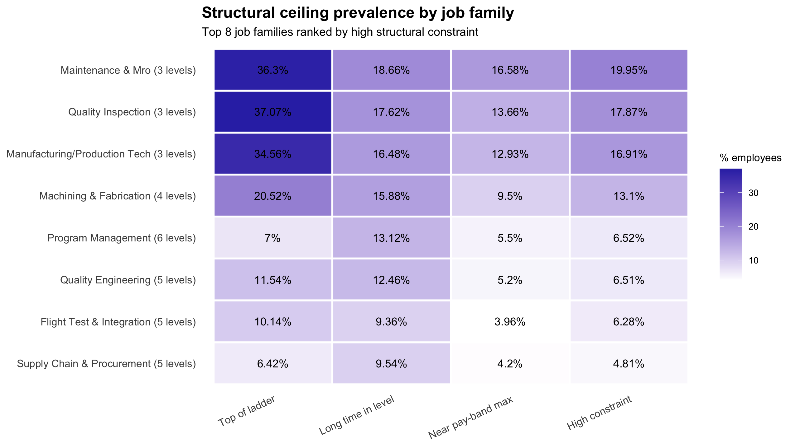
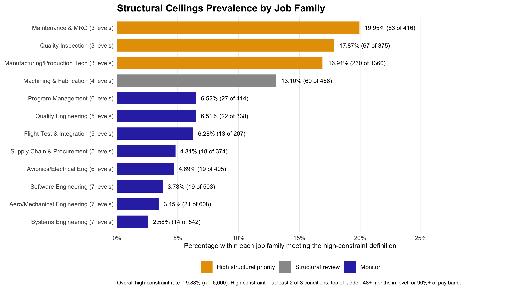

# Aerodyne Employee Listening and Job Architecture Analysis

A reproducible R workforce-analytics project examining where employees 
experience structural career ceilings and how those conditions are
associated with career-growth sentiment, recent promotion, and voluntary
turnover. The analysis combines employee records, job architecture, and 
listening-survey data; validates the career-growth measure; evaluates 
adjusted relationships; assesses equity exposure; and tests the sensitivity
of key assumptions.

## Dataset

The analysis requires the following workbook to be placed in the project’s `data/` subdirectory:

```text
data/Case Dataset Aerodyne.xlsx
```

The workbook is not made available in the public repository. Users must obtain a copy and place it at the path above before running the analysis.

The workbook must contain these tabs:

| Tab | Purpose |
|---|---|
| `README` | Dataset overview and supporting documentation |
| `Data_Dictionary` | Variable definitions and coding details |
| `Employees` | Employee, job, compensation, promotion, and turnover records |
| `Job_Architecture` | Job-family levels, ordering, and salary-band information |
| `Listening_Survey` | Employee listening-survey responses |

The script stops with an informative error when the workbook is missing, a 
required tab is absent, or employee records do not match the job 
architecture.

## Language and Tool Versions

| Component | Version |
|---|---|
| R | R version 4.6.1 (2026-06-24) |
| Platform | x86_64-apple-darwin20 |
| Operating system | macOS |
| Environment management | `renv` |

The analysis uses the following R packages:

```text
readxl
dplyr
janitor
here
broom
psych
ggplot2
tidyr
```

Exact package versions are recorded in `renv.lock`.

## Installation

Open Terminal, clone the repository, and move into the project directory:

```bash
git clone https://github.com/anjalisilva/employeeListening.git
cd employeeListening
```

Start R from Terminal:

```bash
R
```

In the R console, install `renv` if it is not already available:

```r
if (!requireNamespace("renv", quietly = TRUE)) {
  install.packages("renv")
}
```

Restore the project environment from the lockfile:

```r
renv::restore()
```

Exit the R console:

```r
q()
```

`renv::restore()` installs the package versions recorded in `renv.lock`.

Place the authorized dataset in:

```text
data/Case Dataset Aerodyne.xlsx
```

Back in Terminal, run the analysis from the project root:

```bash
Rscript code/run_analysis.R
```

`run_analysis.R` loads required packages, sources all numbered function files
from the `R/` folder in order, creates analysis configuration values, and runs
the complete workflow through `run_analysis()`.

The script asks whether tables and figures should be saved:

```text
Save tables to the tables folder? [y/N]:
Save figures to the figures folder? [y/N]:
```

Both options default to **No**. Enter `y` or `yes` to write CSV tables or
PNG figures to their respective output directories. Pressing Enter, 
or entering any other response does not save those files.

## Project Files

```text
employeeListening/
├── employeeListening.Rproj
├── README.md
├── .Rprofile
├── renv.lock
├── renv/
│   ├── activate.R
│   └── settings.json
├── R/
│   ├── 0_utils.R
│   ├── 1_data.io.R
│   ├── 2_data_preparaation.R
│   ├── 3_question1_structural_ceilings.R
│   ├── 4_question2_business_outcomes.R
│   ├── 5_question3_equity.R
│   ├── 6_question4_sensitivity.R
│   └── 7_pipeline.R
├── code/
│   └── run_analysis.R
├── data/
│   └── Case Dataset Aerodyne.xlsx
├── figures/
│   ├── question1_figure1_structural_bottleneck_heatmap.png
│   └── question1_figure2_structural_bottlenecks_by_job_family.png
└── tables/
    └── optional CSV analysis outputs
```

The Excel workbook is intentionally excluded from the public repository. 
The local `renv` package library should also remain excluded from version
control.

The numbered files in `R/` are sourced in ascending order. Each file contains
functions for one part of the workflow, while `7_pipeline.R` defines
`run_analysis()` and coordinates the full analysis.

## Key Sections

| Question | Analytical approach | Principal finding |
|---|---|---|
| **1. Where do structural career ceilings occur?** | Defines high structural constraint as meeting at least two of three conditions: being at the top of the available job ladder, spending at least 48 months in level, or reaching at least 90% of the assigned pay band. | High constraint affected 593 of 6,000 employees (9.88%) and was concentrated in three short-ladder technical families: Maintenance and MRO (19.95%), Quality Inspection (17.87%), and Manufacturing/Production Tech (16.91%). |
| **2. Are structural ceilings associated with employee and business outcomes?** | Builds a three-item career-growth scale, evaluates internal consistency, compares observed outcomes, and fits adjusted linear and logistic regression models. | The career-growth scale showed good internal consistency (`Cronbach’s alpha = 0.84`). High-constraint employees reported lower career growth (2.16 vs. 3.55), had lower recent-promotion rates (1.69% vs. 18.53%), and had higher voluntary-turnover rates (38.28% vs. 9.30%). Adjusted estimates remained substantial: career growth −0.95 points, promotion OR 0.11, and turnover OR 2.71. Note: OR = Odds ratio. |
| **3. Is there potential equity exposure?** | Compares structural constraint, career growth, promotion, and turnover across gender and age groups, followed by adjusted models that account for workforce composition. | The analysis identifies demographic differences that warrant continued monitoring and formal equity review. These results are treated as diagnostic associations rather than evidence of causality or individual-level decision rules. |
| **4. Are the findings robust, and where should action begin?** | Tests more permissive, base, and stricter threshold scenarios and combines structural, sentiment, promotion, and turnover evidence to prioritize job families. | The evidence supports targeted review and a controlled pilot in the most constrained short-ladder technical families rather than an immediate enterprise-wide redesign. |

Because the source data are observational, adjusted model results describe
associations and should not be interpreted as causal effects.

Key assumptions include defining long time in level as 48 months or more, near 
top of pay band as 90% or more, and high structural constraint as meeting at
least two of three ceiling conditions. Listening-survey items are interpreted
using a 1-to-5 agreement scale, with stuck_1 reverse-scored so higher values 
are favorable. Missing ceiling indicators are treated as no confirmed evidence
of constraint, which may underestimate prevalence, and subgroup results are 
reported only when at least 30 employees are present. Data collection and
extraction dates were not provided, so current relevance of findings could 
not be confirmed.

## Figures



The heatmap above compares the prevalence of individual ceiling indicators and 
the combined high-constraint definition across the eight most constrained
job families.




The bar chart above compares the percentage of employees meeting the 
high-constraint definition within each job family and classifies 
families for high structural priority, structural review, or monitoring.


To display these images on GitHub, run the script, select `y` when
asked whether figures should be saved, and commit the generated PNG
files in `figures/`.

## Contributions

Author of this project is Anjali Silva. This project welcomes issues,
enhancement requests, and other contributions. To submit an issue,
use the GitHub issues page: https://github.com/anjalisilva/employeeListening/tree/main.